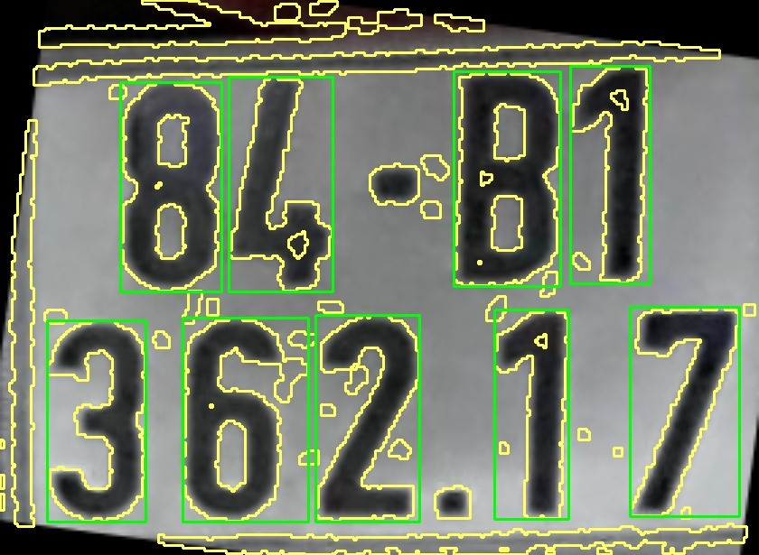
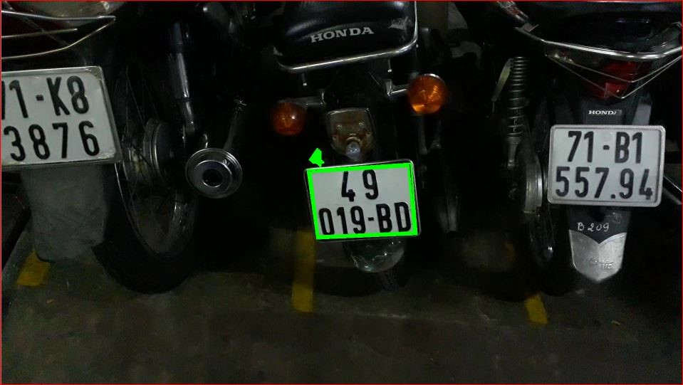

This project using the machine learning method called KNN and OpenCV, which is a powerful library for image processing for recognising the Vietnamese license plate in the parking lot.

For more information, please download the `Vietnamese License Plate.docx` file

**The main stages in the license plate recoginition algorithm**

1. License Plate Detection
2. Character Segmentation
3. Character Recognition

**The main stages in detecting and extract the license plate**

1. Taking picture from the camera
2. Gray scaling
3. Increasing the contrast level
4. Noise Decreasing by Gaussian filter
5. Adaptive threshold for image binarization
6. Canny Edge detection
7. Detect the plate by drawing contours and if..else

To analyze and separate the number plate, we will first trim each picture frame from the input footage. The main goal of this project is to detect a license plate based on a quick shift in light intensity between the license plate and the surroundings, thus we'll transform a gray image to remove the RGB color data. Then, using the morphological procedures Top Hat and Black Hat, we raise the contrast to emphasize more number plates in the background, allowing for binary processing later. Then, using a Gaussian filter, we minimize noise and boost processing speed while removing noisy details that might damage the recognition process.

<i>Figure 3. Maximize Contrast </i>

Using a threshold will assist us distinguish license plate data from background data; in this case, we'll use Adaptive Threshold. After that, we apply the Canny edge detection technique to retrieve the license plate's edge information. The number plate may be confused with noisy features during computer processing; final filtering by high/wide ratios or the license plate area will aid in identifying the proper number plate. Finally, we'll draw a Contour around the number plate in the picture to determine its location.

<i>Figure 4. Canny Edge Detection </i>

<i>Figure 5. Drawing contour and extract the information </i>

**Character segmentation**

To begin, we need to rotate the image to the right direction

The method to rotate the image I use here is:

- Filter out the coordinates of 2 vertices A, B located at the bottom of the number plate
- From 2 vertices with coordinates A(x1, y1) and B(x2,y2) respectively, we can calculate the opposite and adjacent sides of triangle ABC.
- Calculate rotation angle using tan() function
- Rotate the image according to the calculated rotation angle. Otherwise, point A is higher than point B, we give negative rotation angle

                      

<i>Figure 6. Rotation </i>

The contour for the letters is reconstructed from the binary picture (the white part). Then, around those characters, draw rectangles. However, locating this contour is difficult, resulting in inaccurate outcome and the discovery of non-character objects. We'll use the height/width ratio of the character, as well as the character's area in comparison to the number plate.

<i>Figure 7. Character Segmentation </i>

**Character Recognition**

KNN is one of the simplest supervised learning algorithms in Machine Learning, operating in a 4-step process:

1. Determine the parameter K (number of nearest neighbors).
2. Calculate the distance from the point in question to all points in the given data set
3. Sort those distances in ascending order
4. Considering in the set K the closest point to the point under consideration, if the number of points of any kind is higher, it is considered that the point under consideration belongs to that type.

Because each letter is variable in size, the processing is more difficult, thus the picture must be normalized with a height: width ratio of 30:20 pixels. Instead of each character being entered into the model for the system to identify, the keys on the computer will label these characters. We'll save two '.txt' files as 'classifications.txt' and 'flattened images.txt' once we've labeled all the characters. The ASCII codes of those characters are stored in the file classifications.txt, while the values of the pixels in the character image are stored in the file flattened images.txt (20x30 pixel image has a total of 600 pixels worth of pixels, a value of 0 or a value of 255)

Next, we perform the input of the image we are considering and calculate the distances to all points in the sample, the result will be the ASCII code representing that image. Finally, we print out the license plate number.

                      

<i>Figure 8. Print out license plate number </i>

## Nhận dạng kí tự

**Result**

|  Category   | Total number of plates | Nunmber of found plates | Percentage(%) |
| :---------: | :--------------------: | :---------------------: | :-----------: |
| 1 row plate |          370           |           182           |     49,2      |
| 2 row plate |          2349          |           924           |     39,3      |

<i>Table 1. Percentage of finding the license plate in the picture  </i>

When we rotated from many angles, many positions, leading to the calculation of the area, the high / wide ratio of the number plate no longer met the set conditions, so it was eliminated. The number plate can be affected by external details, so the contour approximation does not produce a quadrilateral, leading to the loss of the number plate. This error especially occurs in cars because cars often have a background around the number plate that is strongly reflective materials, which greatly affects the process of determining the number plate area.

                      

<i>Figure 9. Uncorrect plate extraction </i>

The binary processing is also vital in the processing, the image is noisy, and the number plate itself is dark and dusty, causing the binary processing to be halted. If the contour is incorrect, morphological processes such as open and close must be used to recover white lines in binary pictures.

                      

<i>Figure 10. Error in binary image </i>

|    Category    | Nunmber of found plates | 100% correctly recognizized | 1-character uncorrect | 2-character uncorrect | above 3-character uncorrect |
| :------------: | :---------------------: | :-------------------------: | :-------------------: | :-------------------: | :-------------------------: |
|  1 row plates  |           182           |             61              |          88           |          19           |             14              |
| Percentage (%) |           100           |            33,5             |         48,4          |         10,4          |             7,7             |

<i>Table 2. Error rate of character recognition in 1 - row license plate </i>

|    Category    | Nunmber of found plates | 100% correctly recognizized | 1-character uncorrect | 2-character uncorrect | above 3-character uncorrect |
| :------------: | :---------------------: | :-------------------------: | :-------------------: | :-------------------: | :-------------------------: |
|  2 row plates  |           924           |             286             |          273          |          175          |             190             |
| Percentage (%) |           100           |             31              |         29,5          |         18,9          |            20,6             |

<i>Table 3. Error rate of character recognition in 2 - row license plate </i>

In general, the KNN recognition model is also quite good, there are characters that are recognized correctly even though they are blurred or slanted. This is partly thanks to the program that has rotated the number plate to increase recognition, even if it is tilted, the character will only skew from 3° to 7°. However, there is still a lot of confusion between characters such as numbers. 1 with the number 7. The letter G, the letter D, the number 6 with the number 0. The letter B with the number 8...

**Conclusion and future work**

**Advantages:**

- Easy to install and apply.
- Quite light, computers with weak configuration can also handle smoothly compared to other algorithms such as CNN, SVM.
- Suitable for students who want to learn the basics of image processing or artificial intelligence.

**Disadvantages:**

- The recognition ability of KNN is still low, when the data set is too large, the processing time will increase because it has to scan the entire train dataset.
- Poor recognition with the reflection of the license plate, the movement of the image, the glare from the outside environment, the plates with unclear digits, with the license plate of the car

**Future Work:**

- It is necessary to change the KNN recognition algorithm to other more sophisticated and complex algorithms such as CNN, SVM or can use existing libraries in the world such as YOLO, YOLOv3...
- Use a dedicated camera for license plate recognition because it is resistant to fog, dark night, glare...
- Use other image processing algorithms to better determine license plate position such as Hough transform method for line recognition, color identification, algorithms that limit image movement when the vehicle is moving.
